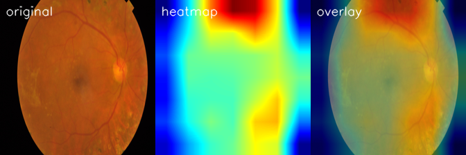

# Retra

Retra is an explainable AI platform for diabetic retinopathy screening from
retinal fundus images. Upload a fundus image, get a DR severity classification
with a confidence score, and see a Grad-CAM heatmap of where the model is
looking.

> Not a medical diagnosis. For research / educational use only.

## What it does

1. Upload a retinal fundus image
2. Classify DR severity (0–4) with EfficientNet-B0
3. Show a confidence score + per-class probabilities
4. Overlay a Grad-CAM heatmap (original | heatmap | overlay)
5. Generate a clean report card

### Severity classes

```text
0 = No DR
1 = Mild
2 = Moderate
3 = Severe
4 = Proliferative DR
```

## Demo



*Original | Grad-CAM heatmap | overlay — the model attending to lesions on a
Proliferative DR case.*

## Structure

```text
retra/
├── frontend/          # Next.js + Tailwind app
├── backend/           # FastAPI model API
├── ml/                # training, inference, grad-cam
├── models/            # saved .pth weights (ignored by git)
├── data/              # dataset (ignored by git)
├── notebooks/         # experiments / EDA
├── docs/              # screenshots / writeup
├── docker-compose.yml
├── README.md
└── .gitignore
```

## Quickstart

### ml

```bash
pip install -r ml/requirements.txt

# train (needs the APTOS dataset under data/)
python ml/train.py --config ml/config.yaml

# predict on a single image
python ml/infer.py --image sample_retina.png

# grad-cam heatmap
python ml/gradcam.py --image sample_retina.png
```

### backend

```bash
pip install -r backend/requirements.txt
cd backend && uvicorn main:app --reload
```

`POST /predict` returns:

```json
{
  "prediction": "Moderate DR",
  "class_id": 2,
  "confidence": 0.914,
  "probabilities": { "No DR": 0.01, "Mild DR": 0.04, "Moderate DR": 0.914, "Severe DR": 0.03, "Proliferative DR": 0.006 },
  "heatmap_url": "/outputs/example_heatmap.png"
}
```

### frontend

```bash
cd frontend
npm install
npm run dev
```

### docker

```bash
docker-compose up --build
```

## Dataset

[Kaggle APTOS 2019 Blindness Detection](https://www.kaggle.com/c/aptos2019-blindness-detection).
See [data/README.md](data/README.md) for the expected layout.

## Stack

- **Model:** EfficientNet-B0 (timm), PyTorch
- **Explainability:** Grad-CAM
- **Backend:** FastAPI
- **Frontend:** Next.js + Tailwind
